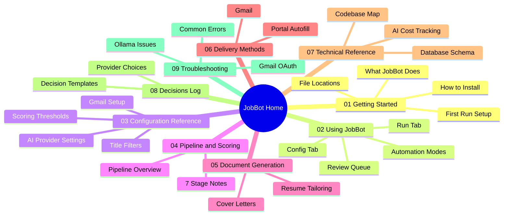

---
tags:
  - home
  - moc
  - current
---

# JobBot Home

JobBot finds job postings, scores them against your resume using AI, generates tailored application documents, and helps you apply — all from a desktop app.

> [!tip] Start Here
> New to JobBot? Begin with [[Getting Started MOC]] to get up and running, then use [[The Review Queue]] as your daily workflow.

## Quick Links

| Task | Note |
|---|---|
| Start a job search run | [[The Run Tab]] |
| Review and send applications | [[The Review Queue]] |
| Adjust scoring sensitivity | [[Scoring Thresholds]] |
| Something isn't working | [[Common Errors]] |

## How the vault is organized

## All Sections

- [[Getting Started MOC]]
- [[Using JobBot MOC]]
- [[Configuration MOC]]
- [[Pipeline MOC]]
- [[Document Generation MOC]]
- [[Delivery MOC]]
- [[Technical Reference MOC]]
- [[Decisions MOC]]
- [[Troubleshooting MOC]]
