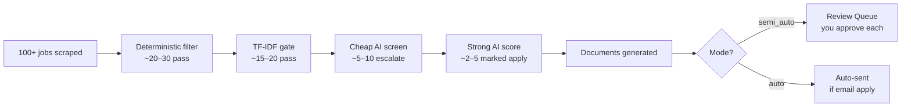

---
tags:
  - getting-started
  - guide
  - current
---

# What JobBot Does

JobBot automates the repetitive parts of job searching: finding postings, deciding if they're worth applying to, and preparing tailored documents — so you only spend time on the jobs that actually fit.

## The funnel in plain language

Every time you run JobBot, it:

1. **Fetches** a batch of job postings from your chosen source (Indeed, Google, USAJobs, or Adzuna)
2. **Filters** out duplicates and jobs with wrong titles
3. **Scores** the remaining jobs against your resume using AI
4. **Generates** a tailored resume and cover letter for the best matches
5. **Queues** the top matches for your review, or sends them automatically

A typical run starts with 100 jobs and ends with 2–5 application-ready candidates.

## What you do

In **semi-auto mode** (the default), your job is to:

1. Click **Start Run** in the Run tab
2. Wait 5–15 minutes for the pipeline to finish
3. Switch to the **Approval tab** and review each queued job
4. Click **Approve and Send** for jobs you want to apply to

JobBot handles the rest — writing the cover letter, tailoring the resume, sending the email or opening the portal.

## Related Notes

- [[Pipeline Overview]] — technical details of each stage
- [[Automation Modes]] — difference between semi-auto and auto
- [[The Review Queue]] — how to work with queued applications
- [[Getting Started MOC]]
