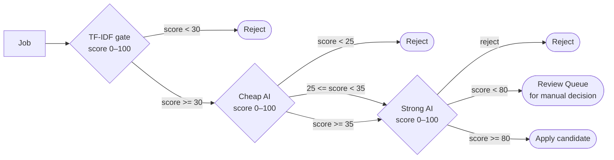

---
tags:
  - configuration
  - reference
  - current
related_code: match_scorer.py, config.py
---

# Scoring Thresholds

Four numeric gates (all 0–100) control which jobs advance through the pipeline. Tuning these is the most impactful thing you can do to improve result quality.

## The four thresholds

| Setting | Default | What happens at this value |
|---|---|---|
| `precheap_gate_reject_threshold` | 30 | Jobs with TF-IDF score below this are rejected before any AI call |
| `cheap_reject_threshold` | 25 | Jobs scoring below this in the cheap AI stage are discarded |
| `cheap_escalate_threshold` | 35 | Jobs scoring at or above this are sent to the strong AI stage |
| `final_apply_threshold` | 80 | Jobs scoring at or above this are marked as apply candidates |

## How scores flow through the pipeline

## Tuning guidance

**Too many false positives (irrelevant jobs in the queue):** Raise `cheap_escalate_threshold` or `final_apply_threshold`.

**Too few jobs reaching the queue:** Lower `cheap_reject_threshold` or `precheap_gate_reject_threshold`. Or disable the pre-cheap gate entirely.

**Nothing ever auto-applies in auto mode:** Lower `final_apply_threshold` — 80 is conservative.

> [!warning] Don't set thresholds too aggressively at first
> The AI scores jobs relative to your resume content. A score of 80 for one resume may be very different for another. Run in semi-auto for a few batches to understand your score distribution before tuning.

## Related Notes

- [[Stage 3 — Precheap TF-IDF Gate]]
- [[Stage 4 — Cheap AI Stage]]
- [[Stage 5 — Strong AI Stage]]
- [[Automation Modes]]
- [[Decision — Scoring Threshold Values]]
