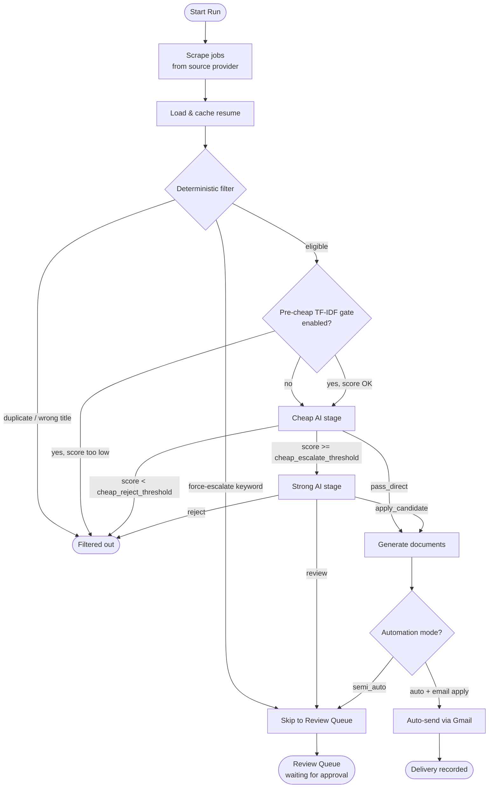

---
tags:
  - pipeline
  - reference
  - current
---

# Pipeline Overview

The pipeline is the sequence of steps JobBot runs every time you click Start Run. It is orchestrated by the `JobBotPipeline` class in `pipeline.py`.

## Full pipeline flowchart

## Stages at a glance

| Stage | File | What it does |
|---|---|---|
| 1. Scrape | `scrapers/` | Fetches job listings from the configured provider |
| 2. Deterministic filter | `deterministic_filter.py` | Removes duplicates, wrong titles; flags force-escalate |
| 3. Pre-cheap gate | `match_scorer.py` | Fast TF-IDF + keyword overlap — free, no AI call |
| 4. Cheap AI | `match_scorer.py` | Low-cost AI model scores and triages jobs |
| 5. Strong AI | `match_scorer.py` | Premium AI model makes final apply/review/reject call |
| 6. Document generation | `doc_generator.py` | Builds tailored resume (DOCX + PDF) and cover letter |
| 7. Delivery | `pipeline.py`, `gmail_client.py` | Sends email or queues for manual approval |

## Execution modes

**Semi-auto (default):** All qualified jobs land in the Review Queue. You approve each one before anything is sent.

**Auto:** Jobs above `final_apply_threshold` with an email apply method are sent automatically. Semi-auto is strongly recommended until you trust the scoring.

## Resume-fit search planning

Before a run starts, the **Fit to Resume** button in the Config tab can now build grouped search suggestions from the configured resume.

It produces:

- a combined query for `source.keyword`
- direct-fit titles for `target_titles`
- adjacent titles for `include_titles`

The goal is to keep search broad enough for recall while still giving fast-rank a cleaner set of direct titles to prefer.

The title-cleanup logic also tries to keep employer names, locations, campaign names, and generic work-description phrases out of the direct-title bucket.

## Typical timing

- 5–15 minutes for a 100-job batch
- Most time is spent on AI API calls (cheap + strong stages)
- Runs with Ollama for cheap stage are faster than all-hosted configurations

## Related Notes

- [[Stage 1 — Scraping]]
- [[Stage 2 — Deterministic Filter]]
- [[Stage 3 — Precheap TF-IDF Gate]]
- [[Stage 4 — Cheap AI Stage]]
- [[Stage 5 — Strong AI Stage]]
- [[Stage 6 — Document Generation]]
- [[Stage 7 — Delivery and Approval]]
- [[Automation Modes]]
- [[The Run Tab]]
