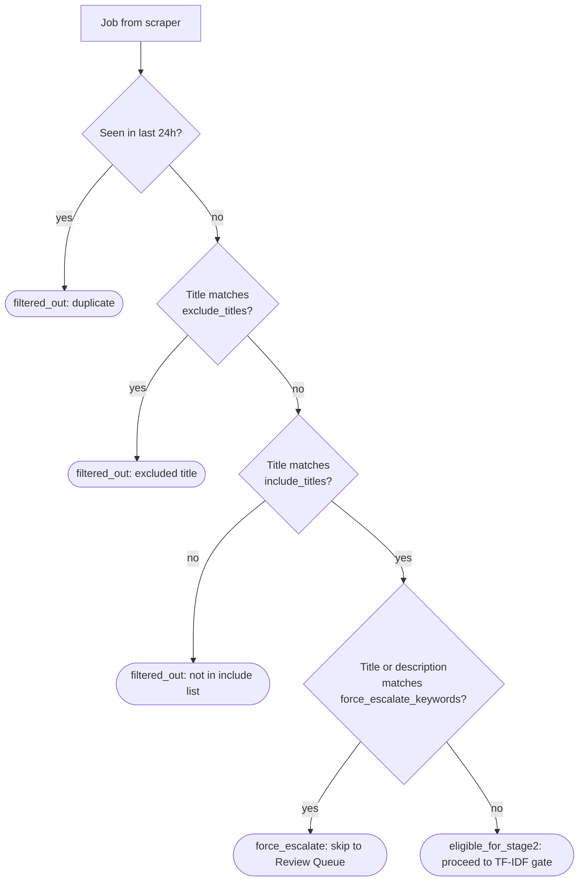

---
tags:
  - pipeline
  - reference
  - current
stage: 2
related_code: deterministic_filter.py
---

# Stage 2 — Deterministic Filter

The first filter after scraping. Runs entirely on rules — no AI, no cost.

## Decision logic

## Outcomes

| Outcome | Meaning |
|---|---|
| `filtered_out` | Job is rejected and not stored |
| `force_escalate` | Job skips AI stages and lands directly in the Review Queue |
| `eligible_for_stage2` | Job continues to the TF-IDF gate |

## Deduplication

Each job's ID is `SHA-256(employer | title | location)`. If a job with that ID was seen in the last 24 hours, it is skipped. This prevents the same posting from appearing in every daily run.

## Title matching

- `include_titles` — the job title must contain at least one of these substrings. Case-insensitive.
- `exclude_titles` — if the job title contains any of these substrings, the job is rejected immediately.
- Matching happens on the job title field only, not the full description.

## Force escalate

If the job title or full description contains any `force_escalate_keywords`, the job bypasses all AI stages and lands in the Review Queue with a `force_escalate` status. Use this for keywords that are strong personal signals — e.g., `llm`, `agent`, or a specific technology you always want to see.

> [!note] Location and salary are not filtered here
> Location and salary filtering moved into the cheap AI prompt so it stays flexible. The deterministic filter only applies title rules and deduplication.

## Related Notes

- [[Title Filters]]
- [[Stage 3 — Precheap TF-IDF Gate]]
- [[Pipeline Overview]]
