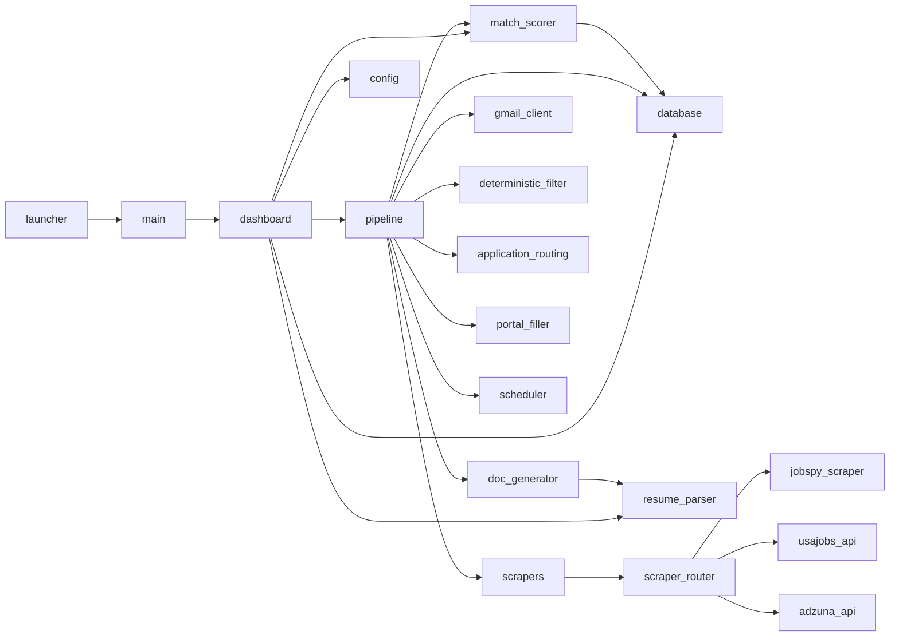

---
tags:
  - technical
  - reference
  - current
---

# Codebase Map

Every Python file in JobBot and its role.

## Module dependency overview

## Entry points

| File | Role |
|---|---|
| `main.py` | Initializes app paths, logging, and launches the dashboard |
| `launcher.pyw` | Windows GUI launcher — catches startup errors and shows dialog |
| `run_jobbot.bat` | Double-clickable launcher that calls `launcher.pyw` |

## Core pipeline

| File | Role |
|---|---|
| `pipeline.py` | Orchestrates all 7 stages; contains `JobBotPipeline` class |
| `config.py` | Config dataclasses, loading, saving, and validation |
| `database.py` | SQLite layer — all reads/writes for jobs, scores, documents, delivery |
| `scheduler.py` | APScheduler wrapper for recurring scheduled runs |

## Scoring

| File | Role |
|---|---|
| `match_scorer.py` | TF-IDF gate, cheap AI stage, strong AI stage; cost tracking |
| `deterministic_filter.py` | Title include/exclude, deduplication, force-escalate detection |

## Document generation

| File | Role |
|---|---|
| `doc_generator.py` | Builds tailored DOCX/PDF resume and cover letter |
| `resume_parser.py` | Parses DOCX/PDF/TXT resumes; caches to JSON |
| `document_tailoring.py` | Data structures for tailoring payloads and AI responses |

## Delivery

| File | Role |
|---|---|
| `gmail_client.py` | Gmail API integration — builds and sends email with attachments |
| `portal_filler.py` | Playwright automation for Greenhouse, Lever, Indeed portal forms |
| `application_routing.py` | Detects email-apply instructions and validates HR email addresses |

## Scrapers

| File | Role |
|---|---|
| `scrapers/scraper_router.py` | Routes to correct scraper based on `source.provider` |
| `scrapers/jobspy_scraper.py` | JobSpy library wrapper for Indeed/Google/LinkedIn |
| `scrapers/usajobs_api.py` | USAJobs federal API client |
| `scrapers/adzuna_api.py` | Adzuna global job board API client |

## Dashboard

| File | Role |
|---|---|
| `dashboard.py` | Full Tkinter GUI — Config tab, Run tab, Approval tab |

## Support

| File | Role |
|---|---|
| `title_classifier.py` | Simple job title matching helper |

## Related Notes

- [[Pipeline Overview]]
- [[Database Schema]]
- [[Running the Tests]]
