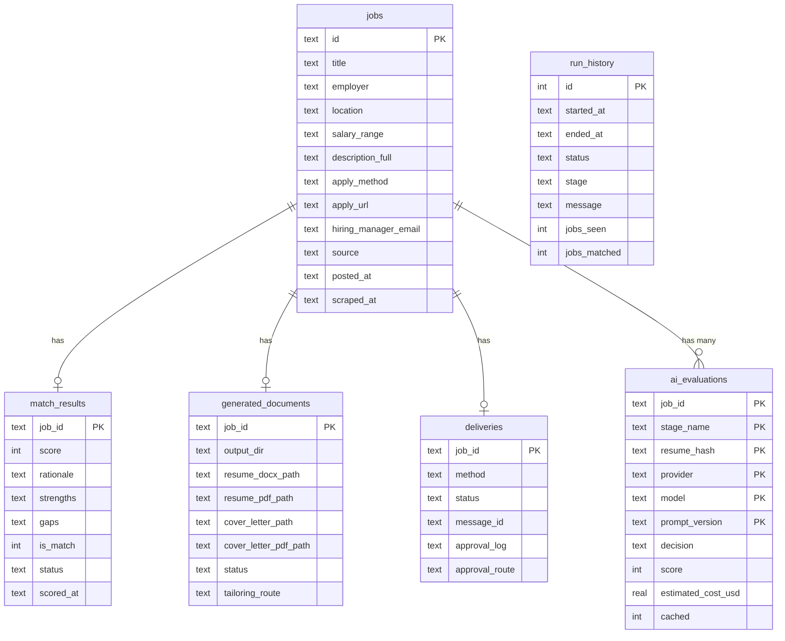

---
tags:
  - technical
  - reference
  - current
related_code: database.py
---

# Database Schema

JobBot stores all data in a SQLite database at `%APPDATA%\JobBot\jobbot.db`. WAL (Write-Ahead Logging) mode is enabled for thread safety.

## Table relationships

## Table descriptions

### jobs
Every scraped job posting. ID is `SHA-256(employer | title | location)` — guarantees deduplication across runs.

### run_history
One row per pipeline run. Tracks start/end time, pipeline stage, and job counts.

### match_results
One row per job. Stores the final match score, rationale, strengths, gaps, and decision status from the strong AI stage.

### generated_documents
Paths to the generated resume and cover letter files for each job. Also records which tailoring route was used and any AI validation attempts.

### deliveries
Delivery status and routing for each job. `status` is `pending_approval`, `sent`, `failed`, or `skipped`. `approval_log` contains the timestamped history of approval actions.

### ai_evaluations
One row per unique combination of job + stage + resume + model. The composite primary key means cached results are automatically reused when the same job is evaluated again with the same resume and model.

## Concurrency

WAL mode allows multiple readers with a single writer. The `Database` class uses a threading lock to serialize writes. Safe for the dashboard's background pipeline thread.

## Related Notes

- [[File Locations on Your Computer]]
- [[Stage 5 — Strong AI Stage]]
- [[AI Cost Tracking]]
